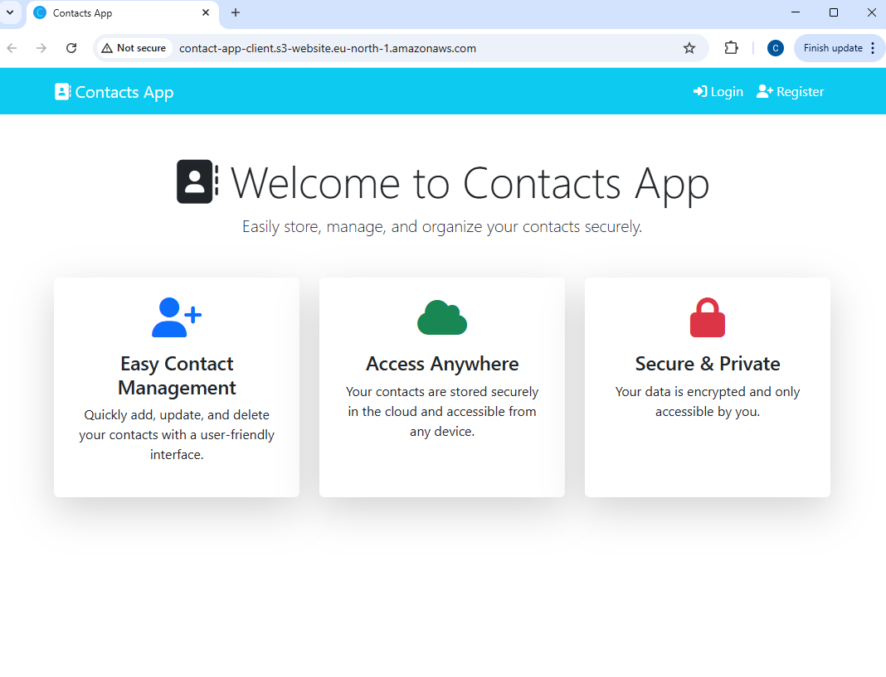
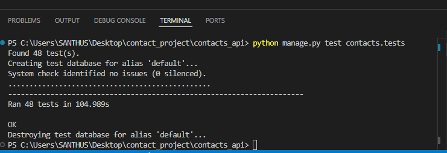

# Contact App

The **Contact App** is a web application featuring user authentication (registration, login, logout) and full CRUD (Create, Read, Update, Delete) functionality for managing contacts. Users can register, log in, add new contacts, view, edit, and delete existing contacts.



---

## Overview

- Users can **register** and **log in** to their account.
- Once logged in, users can **add**, **view**, **edit**, and **delete** their contacts.
- The app ensures **data security** by restricting access to user-specific contacts.

---

## Technologies Used

### Backend

- **Python**
- **Django**
- **Django REST Framework**
- **SQLite** (Database)

### Frontend

- **HTML**
- **jQuery**
- **jQuery DataTables**
- **Bootstrap**
- **Font Awesome** (Icons)

---

## Documentation Links

### [Run Project Locally](RUN-LOCAL.md)

> [!NOTE]  
> Instructions to run the project locally: [RUN-LOCAL.md](RUN-LOCAL.md)

### [Deploy API on AWS EC2](DEPLOY-API-ON-AWS.md)

> [!NOTE]  
> Instructions to deploy the API on AWS EC2: [DEPLOY-API-ON-AWS.md](DEPLOY-API-ON-AWS.md)

### [Deploy Frontend to AWS S3](DEPLOY-FRONTEND-AWS.md)

> [!NOTE]  
> Instructions to deploy the frontend to AWS S3: [DEPLOY-FRONTEND-AWS.md](DEPLOY-FRONTEND-AWS.md)

---

## API Endpoints

### Contact API CRUD Routes

| **Method** | **Endpoint**                | **Functionality**                              |
|------------|-----------------------------|------------------------------------------------|
| `POST`     | `/api/register/`            | Register new user                              |
| `POST`     | `/api/login/`               | User login (obtain token)                      |
| `POST`     | `/api/logout/`              | Logout user (blacklist refresh token)          |
| `GET`      | `/api/user-details/`        | Get details of logged-in user (auth required)  |
| `POST`     | `/api/token/refresh/`       | Refresh access token                           |
| `POST`     | `/api/token/verify/`        | Verify access token                            |
| `GET`      | `/api/contacts/`            | Get all contacts (auth required)               |
| `POST`     | `/api/contacts/create/`     | Create a contact (auth required)               |
| `GET`      | `/api/contacts/<id>/`       | Get single contact by ID (auth required)       |
| `PUT`      | `/api/contacts/<id>/edit/`  | Update contact by ID (auth required)           |
| `DELETE`   | `/api/contacts/<id>/delete/`| Delete contact by ID (auth required)           |

---

## Testing

Unit testing was conducted on the Django backend, covering URLs, models, views, and serializers.

### Python (Unit Testing)

Django's built-in unit testing framework was used to ensure the functionality and reliability of the application.

#### Running Tests

To execute the tests, use the following command in the terminal:

```bash
cd contact_project/contacts_api
python manage.py test contacts.tests
```

